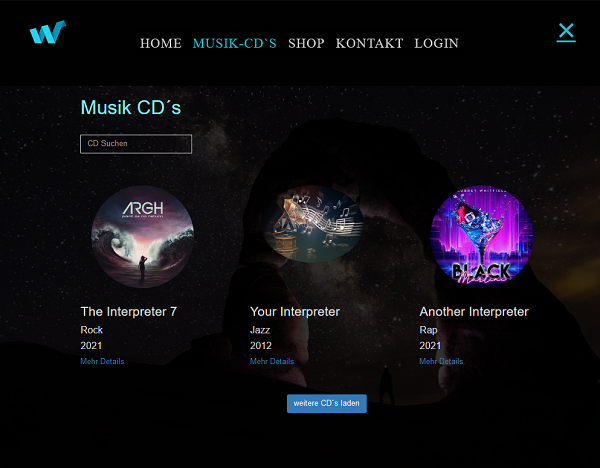
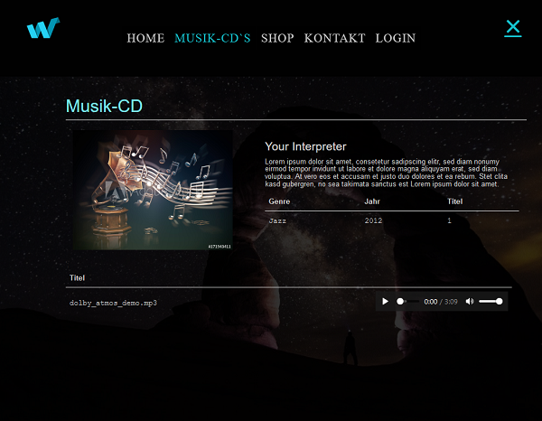
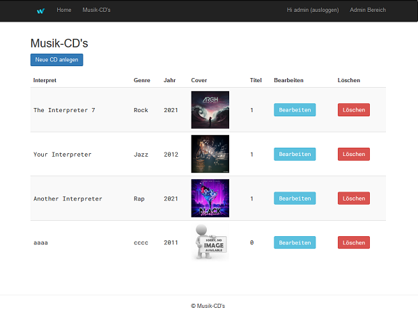
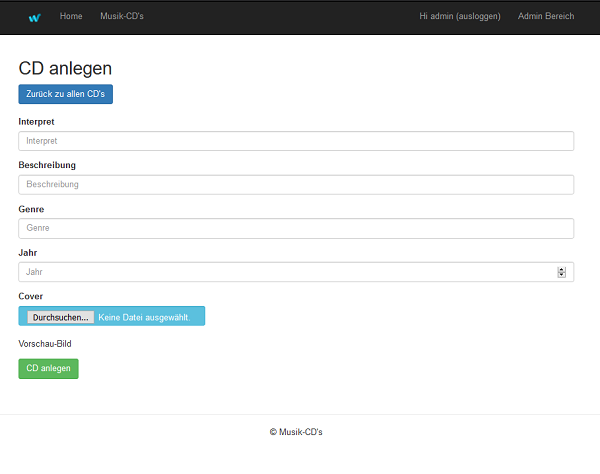
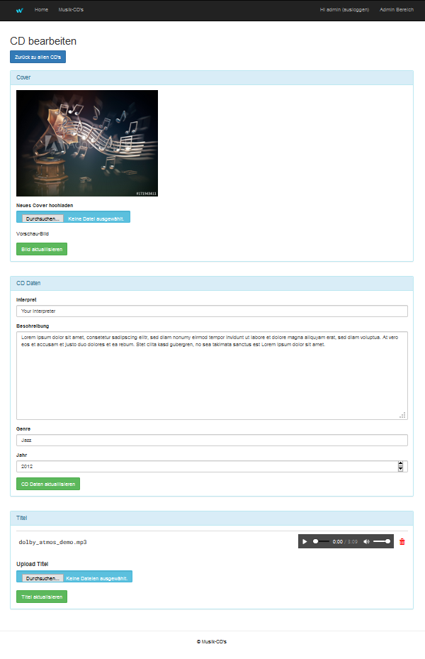

<h1>Musik CD`s</h1>
<h3>Infos</h3>
<ul>
    <b>PHP</b> | <b>MySQL</b> | <b>AJAX</b> | <b>PHPUnit</b> | <b>OOP</b>  | <b>MVC</b>  | <b>Admin</b> | <b>Bootstrap CSS</b>
</ul>
<h3>Vorschau-Bilder</h3>

Benutzer-Bereich

Admin-Bereich

 
<h3>Funktionen</h3>
<ul>
    <li>Alle CDs anzeigen</li>
    <li>CD anlegen mit Interpret, Genre, Jahr, Bild, Audio, ...</li>
    <li>CD bearbeiten - Text - Bild - Audio</li>
    <li>Lieder hochladen, bearbeiten, abspielen</li>
    <li>CD löschen oder Lieder einzelnt löschen</li>
    <li>Email senden</li>
</ul>
<h3>Setup</h3>

In xampp htdocs ein Ordner Namens "cd" erstellen und gezippten Code dort entpacken.

Datenbank kann aus Order "db" der Datei "music.sql" in mySQL importiert werden.

    <h4>Log in</h4>
    <h5>Benutzername = admin</h5>
    <h5>Passwort = admin</h5>
